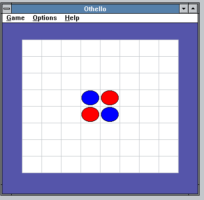

# osFree Janus Reversi

A faithful port of the classic **Othello** board game from OS/2 Presentation Manager to 16-bit Windows 3.0.  
Originally written by Peter Wansch for the OS/2 Entertainment Pack (1994), ported to the [osFree Win16 Personality](https://github.com/osfree-project/WIN16) project — an open-source implementation of the 16-bit Windows environment.

## 📖 About

This application brings the complete Othello (Reversi) experience to Windows 3.0. It includes the full original game logic and computer AI, adapted from the OS/2 Presentation Manager API to the Win16 API. The port preserves every algorithm, heuristic, and gameplay element of the original, with only the system-dependent parts rewritten for Windows 3.0.

The computer opponent uses a minimax algorithm with alpha-beta pruning, configurable to three difficulty levels. The game supports both mouse and keyboard input, visual move hints, background colour customization, and basic sound feedback.

## ✨ Features

- **Authentic game logic** – Exact copy of the original OS/2 AI and board evaluation
- **Three difficulty levels** – Beginner, Advanced, and Master
- **Configurable start** – Player or computer can move first
- **Interactive board** – Mouse clicks and keyboard navigation (arrow keys, Space/Enter to place)
- **Visual hints** – Computer suggests its recommended move (cursor jumps to the cell)
- **Background colours** – 16 selectable board background colours via menu
- **Sound feedback** – Audio cues for moves, illegal actions, and game end (emulated via `MessageBeep`)
- **Keyboard accelerators** – `Ctrl+N` (New game), `Ctrl+H` (Hint)
- **INI persistence** – Remembers colour, sound, level, and first-player settings in `WIN.INI`
- **Dialog boxes** – Product information and sound settings dialogs
- **Clean C89 code** – Strict adherence to ANSI C, compiled with OpenWatcom 1.9

## 🧩 Project Structure

| File | Description |
| :--- | :--- |
| `othello.c` | Main game source — WinMain, WndProc, dialogs, game logic, AI |
| `othello.h` | Header file — constants, resource IDs, type definitions, prototypes |
| `othello.rc` | Resource file — menus, accelerators, dialogs, bitmaps |
| `makefile` | Build file for OpenWatcom Make |
| `color0.bmp` … `color15.bmp` | Bitmap files for the background colour sub-menu (optional) |
| `othello.ico` | Application icon (optional) |
| `reversi.png` | Screenshot of the running application |
| `readme.md` | This documentation file |

## 🕹️ How to Play

- **New game** — `Ctrl+N` or *Game → New*
- **Player's move** — Click on a board cell (cursor becomes a cross when a move is possible)
- **Computer's move** — Automatic after the player has moved
- **Hint** — `Ctrl+H` or *Game → Hint*; the mouse pointer jumps to the suggested cell
- **Difficulty** — *Options → Beginner / Advanced / Master*
- **Who starts** — *Options → Player starts / Computer starts*
- **Background colour** — *Options → Background color* (16 colours)
- **Sound** — *Options → Sound…* (toggles beeps on/off)
- **About** — *Help → Product information…*

## 🤝 Contributing

We welcome your contributions! Please keep the following in mind:

- **Bug reports** – Create issues in the [Issues](https://github.com/osfree-project/WIN16/issues) section of the WIN16 repository.
- **Pull requests** – Send your improvements and fixes.
- **Code style** – The project uses C89; please follow the existing conventions.
- **Documentation** – Help improve this README and other project documentation.

## 📜 License

The original Othello code is copyright (C) 1994 Peter Wansch.  
The osFree Janus Reversi is distributed under the **BSD 3-Clause License**.  

## 🔗 Related Projects

- [osFree Win16 Personality (WIN16)](https://github.com/osfree-project/WIN16) – the main project to create an open-source clone of Windows 3.x
- [osFree Project](https://github.com/osfree-project) – the parent project for an open-source OS/2 clone
- [Control Panel](https://github.com/osfree-project/WIN16/tree/master/applications/control) – a clone of the Windows 3.x Control Panel
- [winver](https://github.com/osfree-project/winver) – a clone of the About dialog
- [Notepad](https://github.com/osfree-project/notepad) – a clone of Notepad
- [Taskman](https://github.com/osfree-project/taskman) – a clone of Task Manager

## 👤 Copyright

- Original Othello (C) 1994 Peter Wansch
- Port to Windows 3.0 (C) 2026 Yuri Prokushev and the [osFree](https://github.com/osfree-project) team

---

*Last updated: May 28, 2026*
